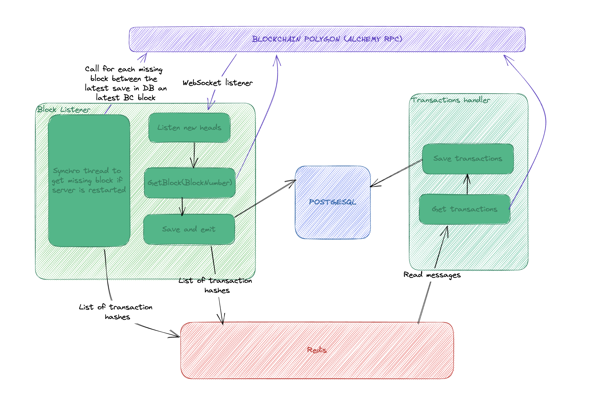

# Listener Service

## Overview

The Listener Service is a Node.js application built with NestJS that listens for new blocks on the Polygon network and saves them to a PostgreSQL database. It also emits the transaction hashes for the new blocks to a dedicated worker via a Redis message queue.

### Architecture



Solution microservices has an architecture based on redis (we can use something more strong like kafka/rabbitMQ).
The block listener process each block from the blockchain, and send to redis an array of transactions, in the other side transaction microservice listen redis on transactions topic and process all transactions.

### API

I set up a little endpoint to get all the forked block at `localhost:3000/block/forked` and swagger at `localhost:3000/documentation`

### Lock

1 : Synchronisation DB : when block service start he run synchronisation db process at the begining, he try to aquire lock status from db to be sure this service is the only one to run the process and release it at the end

2 : Block listening : For each block I set a lock on db based on the block hash to be sure to don't process it twice in other instance of the service. First algo use the hash direct from the head block object get from the listener on the websocket. But with ethers v5.7 I had some issue on WebSocket stability, this problem is resolved on ethers v6 the problem is in v6 the subscriber only return the block number and I need to proceed a get Block even I will not store it in DB.

Solution : get subscriber code from ethers and integrate it inside the code base and update the ws on block behavior (problem each ethers update means go back on this file to update it manualy)

3 : Transactions processing : For each event catch on redis I create a lock on block hash, in that way if a transaction instance catch an event two behavior :
-- the block hash isn't lock in transaction side and the service will process all the transaction get from redis
-- the block hash is lock and the service just ignore all the transactions array

### Restartability

Listener get each block from the start of the application.
But even the application crashed and automaticaly restart it may possible we miss some block.
So I create a thread which be launch at the begining and check if there is some missing block between the last saved block and the latest block on chain finaly run an algo to get back those block in db to be sync with the chain.

/block/src/main.ts line 19

```
 appService.runWorker();

```

/block/src/sync-worker

```
sync function run() {
  const app = await NestFactory.createApplicationContext(AppModule);
  const synchronisationService = app
    .select(ListenerModule)
    .get(SynchronisationService, { strict: true });

  const appService = app.select(AppModule).get(AppService, { strict: true });

  appService.checkMainThread();
  try {
    const blockNumber = await synchronisationService.dbSynchronisation();
    parentPort.postMessage(blockNumber);
  } catch (error) {
    this.logger.error(error);
  }
}

run();

```

### Algo forkblock

When I catch twice a block number I check in database if my block in db have the same hash if not I run recusive function :

/block/src/listener/listener.service.ts :

```
 /**
   * Flags a forked block and its previous blocks in the database.
   *
   * @param parentHash - the parent hash of the forked block.
   * @param blockNumber - the block number of the forked block.
   */
  async flagForkBlock({
    parentHash,
    blockNumber,
  }: {
    parentHash: string;
    blockNumber: number;
  }): Promise<void> {
    const block = await this.em.findOne(Block, { number: blockNumber });

    await this.em.upsert(Block, { ...block, isForked: true });

    if (
      (
        await this.em.findOne(Block, {
          number: blockNumber - 1,
        })
      ).hash !== parentHash
    ) {
      return await this.flagForkBlock({
        parentHash,
        blockNumber: blockNumber - 1,
      });
    }

    return;
  }
```

### Amelioration

- With monorepo solution like NX or turbo to create lib to avoid duplicate code
- Use stronger solution than redis with kafka or rabbitMQ and set up ttl manament with strong cache on transactions messaging to be sure to don't loose anything
- set up lock topic in broker
- Add strong repository layer to handle query,transaction rollback and for the future create strong query to provide analytics system
- Add e2e testing to be sure of the behavior, and to protect against library savage upgrade or dirty code upgrade
- Use personal node to aviod third party cost like alchemy

## Requirements

- Docker

## Environment Variables

The following environment variables must be set before running the Listener Service:

```sh
export ALCHEMY_API_KEY=0RpStnsARsdyQAjJLa2bHzMO0rJTn4re #Your Alchemy API key for the Polygon network
export ALCHEMY_BASE_WS=wss://polygon-mainnet.g.alchemy.com/v2/ #The WebSocket endpoint for the Polygon network on Alchemy
export POSTGRES_USER=yourusername #The username for the PostgreSQL database
export POSTGRES_PASSWORD=yourpassword #The password for the PostgreSQL database
export POSTGRES_DB=indexation #The name of the PostgreSQL database
export POSTGRES_ENDPOINT=db #The endpoint for the PostgreSQL server
export POSTGRES_PORT=5432 #The port for the PostgreSQL server
export REDIS_ENDPOINT=my_redis #The endpoint for the Redis server
export REDIS_PORT=6379 #The port for the Redis server
export API_PORT=3000 #The port for api
```

set up one file in each service

## Running the Service

To run the Listener Service, clone the repository and install the dependencies:

```sh
git clone git@github.com:OlremProj/technical-test.git
cd technical-test
```

Then, start the service with the following command:

```sh
docker-compose up
```

And you will see database populate with blocks and transactions information.
