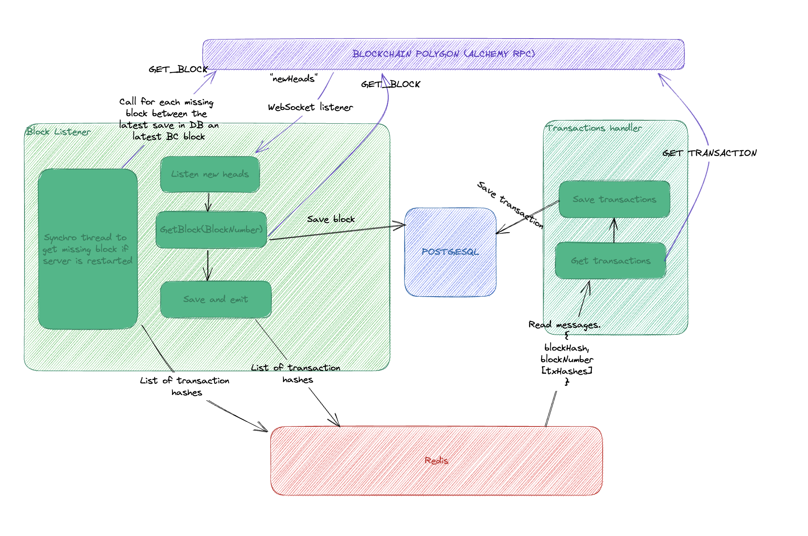

# Listener Service

## Overview

The Listener Service is a Node.js application built with NestJS that listens for new blocks on the Polygon network and saves them to a PostgreSQL database. It also emits the transaction hashes for the new blocks to a dedicated worker via a Redis message queue.

### Architecture



## Requirements

- Node.js v18
- PostgreSQL v15
- Redis

## Environment Variables

The following environment variables must be set before running the Listener Service:

- `ALCHEMY_API_KEY`: Your Alchemy API key for the Polygon network
- `ALCHEMY_BASE_WS`: The WebSocket endpoint for the Polygon network on Alchemy
- `POSTGRES_USER`: The username for the PostgreSQL database
- `POSTGRES_PASSWORD`: The password for the PostgreSQL database
- `POSTGRES_DB`: The name of the PostgreSQL database
- `POSTGRES_ENDPOINT`: The endpoint for the PostgreSQL server
- `POSTGRES_PORT`: The port for the PostgreSQL server
- `REDIS_ENDPOINT`: The endpoint for the Redis server
- `REDIS_PORT`: The port for the Redis server
- `API_PORT`: The port for api

Example values:

```sh
export ALCHEMY_API_KEY=0RpStnsARsdyQAjJLa2bHzMO0rJTn4re
export ALCHEMY_BASE_WS=wss://polygon-mainnet.g.alchemy.com/v2/
export POSTGRES_USER=yourusername
export POSTGRES_PASSWORD=yourpassword
export POSTGRES_DB=indexation
export POSTGRES_ENDPOINT=db
export POSTGRES_PORT=5432
export REDIS_ENDPOINT=my_redis
export REDIS_PORT=6379
export API_PORT=3000
```

## Running the Service

To run the Listener Service, clone the repository and install the dependencies:

```sh
git clone git@github.com:OlremProj/technical-test.git
cd technical-test
```

Then, start the service with the following command:

```sh
docker-compose up
```

or

```sh
docker-compose up -d
```

And you will see database populate with blocks and transactions information.

By default, the service will listen for new blocks indefinitely. You can stop the service with `Ctrl + C`.
or

```sh
docker-compose down
```
